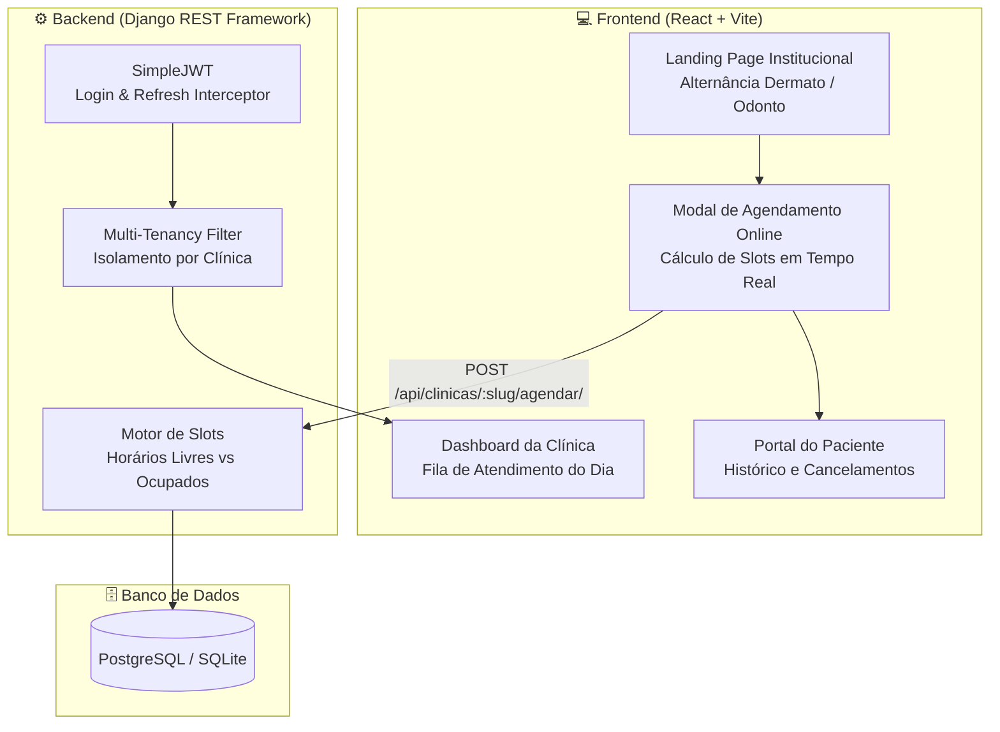

# 🏥 Sistema Clínico Multi-Tenant & Agendamento Inteligente

> Plataforma SaaS clínica multi-especialidade (Dermatologia e Odontologia), construída com isolamento lógico de dados (*multi-tenancy*), motor de agendamento online com cálculo em tempo real de horários disponíveis (*slots*), portal do paciente e painel de atendimento para profissionais e recepção.


---

## 🌟 Destaques do Projeto

### 1. 🏢 Arquitetura Multi-Tenant por Coluna
- Modelo centralizado em **Banco Único** com isolamento de dados transparente via entidade `Clinica`.
- Os atendimentos, pacientes e filas da **Dermatologia** nunca se misturam com os da **Odontologia**.
- O sistema suporta profissionais dedicados por clínica e usuários com visão Master (*Admin Geral*).

### 2. ⏱️ Motor de Agendamento com Cálculo Dinâmico de Slots
- **Slots flexíveis por especialidade:**
  - 🩺 **Dermatologia:** Slots de **20 minutos** por consulta.
  - 🦷 **Odontologia:** Slots de **40 minutos** por consulta.
- A API calcula os horários vagos em tempo real com base no horário de funcionamento (08h às 18h), descartando horários já reservados e horários que já passaram no dia atual.
- **Prevenção de Double-Booking:** Transações atômicas com tratamento de concorrência (`HTTP 409 Conflict`).

### 3. 👤 Portal do Paciente & Criação Automática de Acesso
- O visitante pode escolher o dia e o horário conveniente diretamente pela Landing Page institucional.
- Ao confirmar o agendamento, o sistema cria sua conta com senha e já envia os tokens JWT para login imediato.
- No **Portal do Paciente**, é possível acompanhar consultas agendadas e realizar cancelamentos com um clique.

### 4. 🩺 "Duas Janelas" de Atendimento (Painel Profissional & Recepção)
- Ao logar como profissional ou recepcionista da Dermatologia, o sistema renderiza automaticamente o tema, métricas e fila de espera da **Dermatologia**.
- Ao logar como profissional da Odontologia, a interface assume o ecossistema da **Odontologia**.
- Botões de ação rápida: **Confirmar Chegada na Recepção**, **Atender/Concluir** e **Cancelar**.

### 5. 🔐 Autenticação Robusta JWT com Interceptor Axios
- Rotação de tokens (`access` e `refresh`).
- Fila assíncrona de requisições no frontend: quando o token expira, requisições simultâneas aguardam a renovação sem deslogar o usuário ou gerar falhas na tela.

---

## 📐 Arquitetura do Sistema



---

## 🔑 Contas de Demonstração Rápidas

Para facilitar a avaliação por recrutadores e testes rápidos, o projeto já inclui um comando de *seed* com as seguintes contas pré-configuradas:

| Perfil | Usuário | Senha | Clínica Vinculada | O que visualiza |
|---|---|---|---|---|
| **Profissional Dermato** | `dermato` | `dermato123` | Dermatologia | Janela e fila de Dermatologia (slots 20m) |
| **Profissional Odonto** | `odonto` | `odonto123` | Odontologia | Janela e fila de Odontologia (slots 40m) |
| **Recepção Dermato** | `recep_dermato` | `recep123` | Dermatologia | Fila de espera e check-in Dermato |
| **Recepção Odonto** | `recep_odonto` | `recep123` | Odontologia | Fila de espera e check-in Odonto |
| **Admin Geral** | `admin` | `admin123` | Master (Todas) | Alternância livre entre clínicas |
| **Paciente Demo** | `paciente` | `paciente123` | - | Portal do Paciente com consultas agendadas |

> 💡 *Na tela de login, há botões de 1 clique para preencher qualquer uma dessas credenciais instantaneamente!*

---

## 🚀 Como Executar o Projeto Localmente

### Pré-requisitos
- Python 3.12+ (ou 3.14)
- Node.js 18+ e npm

---

### 1. Backend (Django)

```bash
# Entrar no diretório do backend
cd backend

# Instalar dependências (via Poetry ou pip)
poetry install
# ou: pip install -r requirements.txt

# Executar as migrações do banco
poetry run python manage.py migrate

# Popular o banco com as clínicas e dados demo
poetry run python manage.py seed_data

# Iniciar o servidor da API (porta 8000)
poetry run python manage.py runserver
```

---

### 2. Frontend (React + Vite)

```bash
# Entrar no diretório do frontend
cd Recep

# Instalar as dependências
npm install

# Iniciar o servidor de desenvolvimento
npm run frontend
```

Abra no navegador: `http://localhost:5173`

---

## 📡 Principais Endpoints da API

- `GET /api/clinicas/` - Lista as clínicas ativas.
- `GET /api/clinicas/{slug}/horarios-disponiveis/?data=AAAA-MM-DD` - Retorna horários livres calculados para a data.
- `POST /api/clinicas/{slug}/agendar/` - Agendamento público com criação de conta para o paciente.
- `GET /api/usuarios/me/` - Retorna dados do usuário autenticado e sua clínica.
- `GET /api/agendamentos/` - Lista agendamentos filtrados pela clínica do profissional logado.
- `GET /api/agendamentos/meus/` - Lista agendamentos do paciente logado.
- `POST /api/agendamentos/{id}/cancelar/` - Cancela um agendamento.
- `PATCH /api/agendamentos/{id}/status/` - Atualiza o status (`agendado` ➔ `confirmado` ➔ `realizado`).
- `POST /api/token/` - Autenticação JWT (`access` e `refresh`).

---

## 🛠️ Tecnologias Utilizadas

- **Frontend:** React 18, Vite, React Router DOM 6, React Icons, Axios.
- **Backend:** Python, Django 6, Django REST Framework, Django SimpleJWT, Django-Cors-Headers.
- **Banco de Dados:** SQLite (modo desenvolvimento ágil) com suporte configurado para PostgreSQL.

---

## 🤝 Equipe de Desenvolvimento

Este projeto foi construído colaborativamente a duas mãos, unindo esforços no desenvolvimento fullstack, arquitetura de software e design de banco de dados. 

| 🧑‍💻 **Jonathan Duarte** | 🧑‍💻 **Ramon Nogueira** |
| :--- | :--- |
| ✉️ devjonathanduarte@gmail.com | ✉️️ [Insira o Email do Ramon aqui] |
| 🐙 [GitHub](https://github.com/devjonathanduarte) | 🐙 [GitHub](https://github.com/UsuarioDoRamonAqui) |
| 💼 [LinkedIn](https://www.linkedin.com/in/SEU-LINK-AQUI) | 💼 [LinkedIn](https://www.linkedin.com/in/LINK-DO-RAMON-AQUI) |

> *Trabalhar em dupla nos permitiu aplicar boas práticas de versionamento (Git/GitHub), code review e divisão eficiente de tarefas ao longo do ciclo de vida da aplicação.*